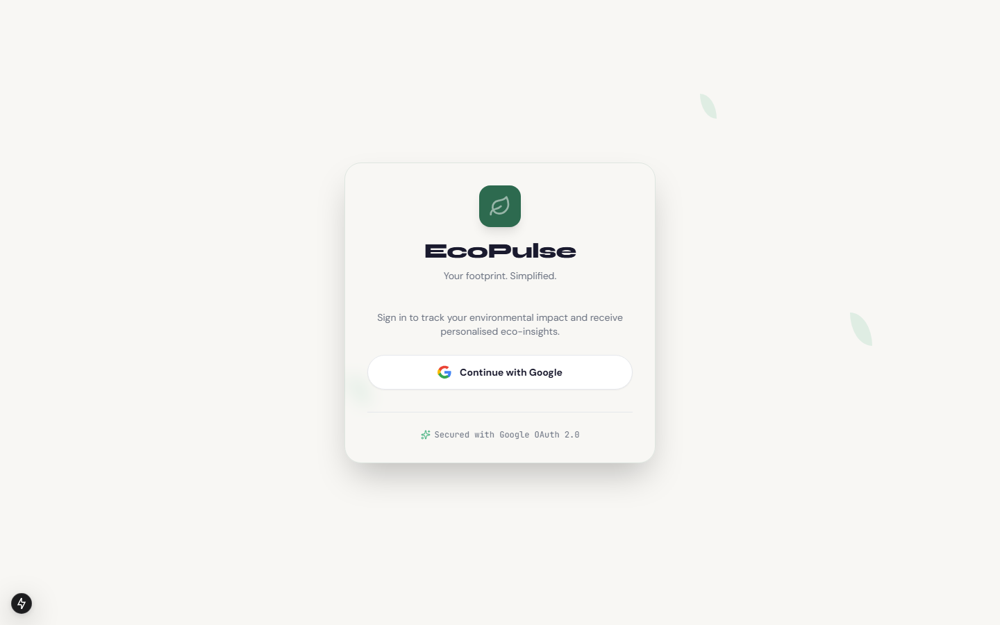
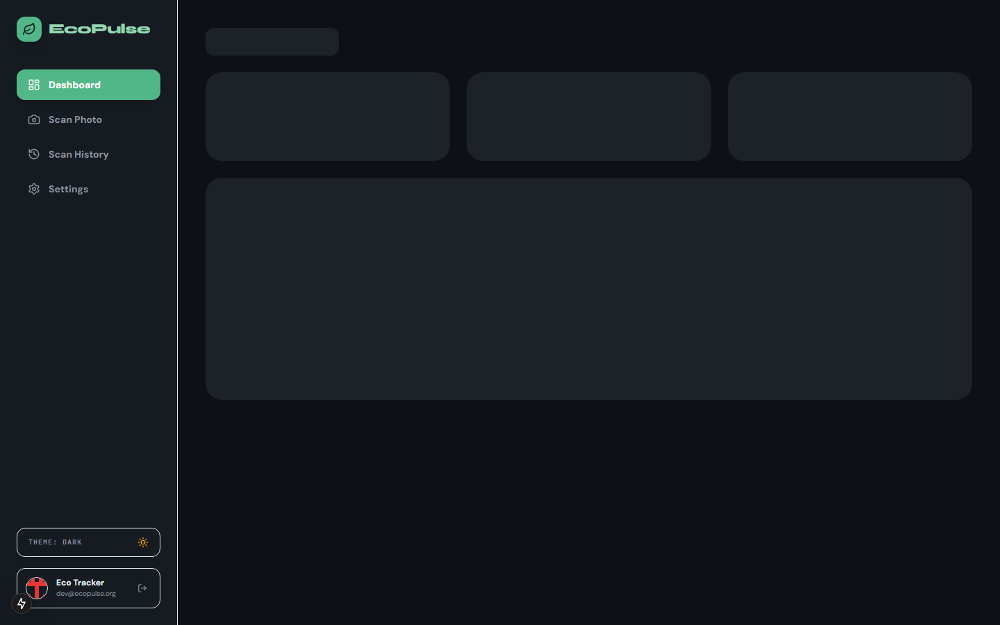
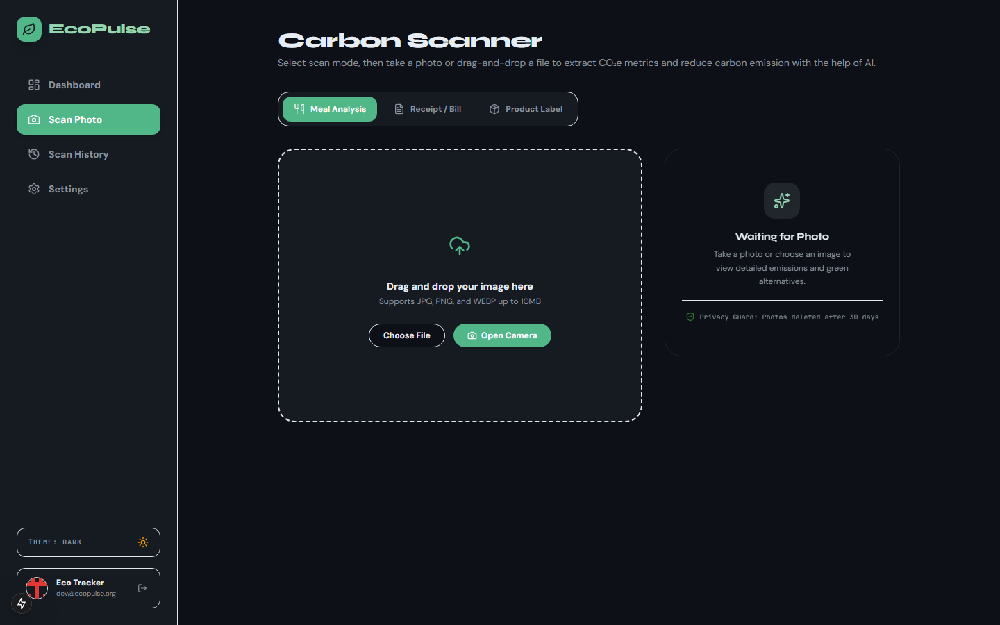
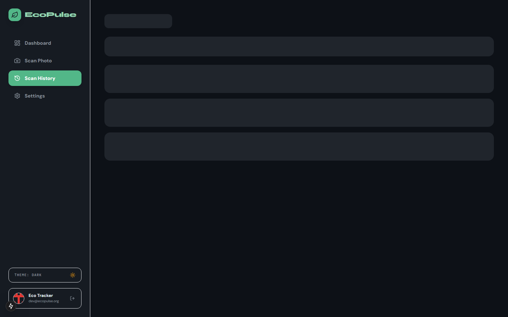
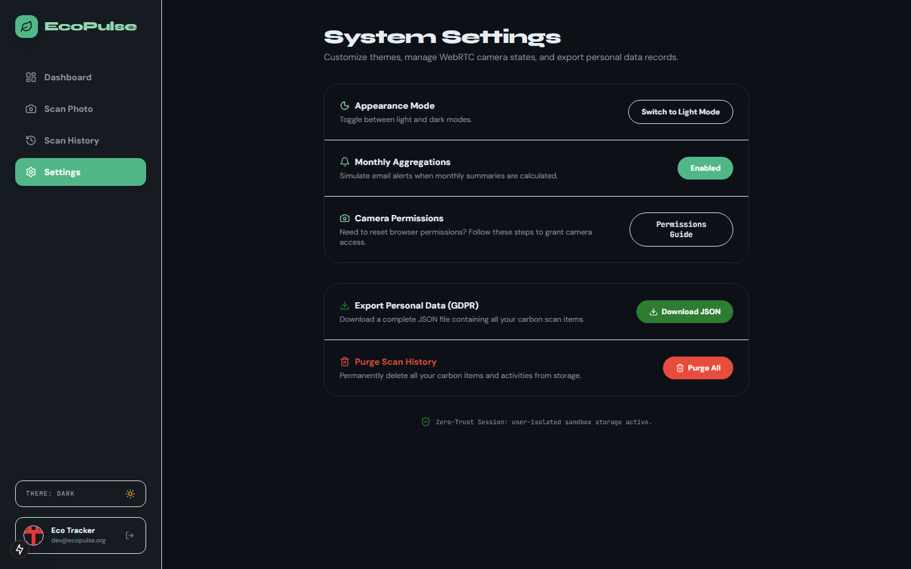

# 🌿 EcoPulse — Personal Sustainability Tracker

EcoPulse is a full-stack, AI-powered carbon footprint awareness platform that helps individuals monitor, understand, and reduce their daily greenhouse gas emissions. Featuring real-time image scanning, an interactive dashboard, and a secure backend data pipeline, EcoPulse translates daily activities into actionable environmental insights.

---

## 📸 Application Showcase

### 🔐 1. Landing & Authentication Page
The entry point features a sleek, animated glassmorphism card supporting secure sign-in via Google OAuth 2.0.


### 📊 2. Emissions Dashboard
An analytics dashboard displaying monthly totals, potential eco-savings, a daily trend chart (interactive area graphs using Recharts), category breakdowns (Food, Transport, Goods, Energy), and a feed of recent activities.


### 📷 3. AI Carbon Scanner
An interactive scanner supporting live camera capture or drag-and-drop file uploads. It utilizes the Gemini Vision API (`gemini-2.5-flash`) on the backend to parse meals, receipt details, or product packaging labels and estimate carbon equivalents ($CO_2e$).


### 📜 4. Scan History Timeline
A complete history log allowing users to review details of every logged scan (items, quantities, carbon impact tier) and manage their footprint data.


### ⚙️ 5. Personal Settings
Provides data portability and privacy management. Users can download a JSON export of their carbon footprint history or clear all recorded scans.


---

## 🚀 Key Features

* **AI-Powered Image Analysis**: Snap a picture of a meal, receipt, or product label. EcoPulse uses Gemini Vision to detect items and estimate their carbon equivalents ($CO_2e$) in real-time.
* **Synchronous Local Camera Processing**: Decodes webcam frames directly in browser memory, bypassing Content Security Policy (CSP) fetch blocks.
* **Emissions Analytics**: Visualize daily emission trends and category distributions with interactive charts.
* **Eco-friendly Alternatives**: Get recommendations for alternative choices (e.g. salmon instead of beef) and see your potential emissions savings.
* **Privacy Controls**: Full GDPR-compliant data portability (export scan data) and account resetting.
* **Hybrid Data Storage**: Backend pipelines auto-initialize tables on Google BigQuery, falling back to local JSON storage if GCP is not configured.

---

## 🛠️ Architecture

* **Frontend**: Next.js 15 (App Router), React 19, Tailwind CSS, Recharts, NextAuth.js
* **Backend**: Python 3.13, FastAPI, Uvicorn, Pillow (image preprocessing), Pydantic (data validation)
* **AI Model**: Google Gemini (`gemini-2.5-flash`) via `google.generativeai` SDK
* **Database**: Local JSON Storage (fallback) & Google BigQuery

---

## ⚙️ Quick Start

### 1. Python API Backend
1. Navigate to the backend directory:
   ```bash
   cd python
   ```
2. Install packages inside your virtual environment:
   ```bash
   pip install -r requirements.txt
   ```
3. Start the API server:
   ```bash
   python api/main.py
   ```
   *The backend will boot up at `http://localhost:8000`.*

### 2. Next.js Frontend
1. Navigate to the frontend directory:
   ```bash
   cd nextjs
   ```
2. Install client dependencies:
   ```bash
   npm install --legacy-peer-deps
   ```
3. Run the Next.js dev server:
   ```bash
   npm run dev
   ```
   *The application will be accessible at `http://localhost:3000`.*
